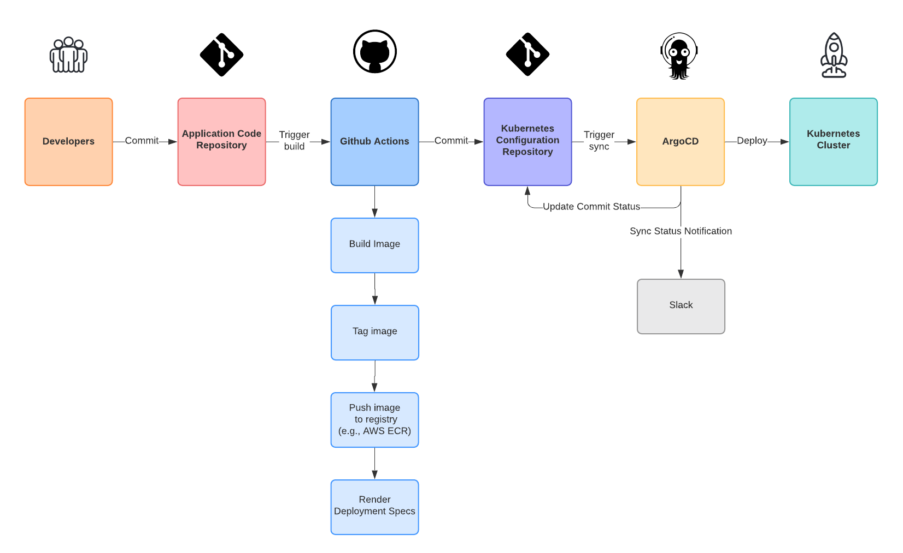

# go-hello-http

A simple HTTP server written in Go.

This repository is used to demonstrate a rudimentary CI/CD pipeline for applications deployed to Kubernetes clusters using a [GitOps](https://www.gitops.tech/) process. 

## CI/CD Pipeline

The CI/CD pipeline is used to completely automate the process of building, publishing and deploying an application from a single commit or PR merge.

The following diagram illustrates the various phases of the pipeline.

### Phase: Continuous Integration

The Continous Integration phase is implemented using a [GitHub Actions](https://github.com/features/actions) workflow. 

This phase could also be built using other continuous integration tools/services such as [Buildkite](https://buildkite.com/).

#### Step: Build image

Builds the application and its Docker image.

#### Step: Tag image

Tags the Docker image with the current git commit sha.

#### Step: Push image to registry

Pushes the new Docker image to a [Dockerhub image repository](https://hub.docker.com/repository/docker/etiennep/go-hello-http).

The docker image could also be pushed to any docker registry such as ECR.

#### Step: Update Deployment Specs

Once the docker image has been published, the workflow updates the image tag in the Kubernetes [deployment specs](kubernetes/app.yaml).

Since this is a rudimentary example, we use `sed` to replace the `:latest` tag with the docker image tag used in the previous steps. 

Deployment spec could also be rendered other tools such as [Helm](https://helm.sh/) and [Kustomize](https://kustomize.io/). All you need is a way to create static Kubernetes configuration yaml.

Once the deployment specs have been updated and re-rendered, they are committed to the [configuration repository](https://github.com/etiennep/k8s-go-hello-http).

### Phase: Deployment

The deployment phase of the CI/CD pipeline is triggered once the updated kubernetes deployment specs are committed to the [configuration repository](https://github.com/etiennep/k8s-go-hello-http).

This can be accomplished with any GitOps based continous deployment tools such as [ArgoCD](https://argoproj.github.io/argo-cd/) and [Flux](https://fluxcd.io/)

This example is built using [minikube](https://minikube.sigs.k8s.iohttps://minikube.sigs.k8s.io/docs/), [ArgoCD](https://argoproj.github.io/argo-cd/), [ArgoCD ApplicationSets](https://argocd-applicationset.readthedocs.io/en/stable/), and [ArgoCD Notifications](https://argocd-notifications.readthedocs.io/en/stable/).

Once the updated specs are committed, ArgoCD automatically syncs the application on the target Kubernetes cluster(s). Once the sync is completed, the commit status is automatically updated, and a notification sent to a Slack channel.

### Missing Steps/Phases

Missing from this example are steps necessary to peform the following:

* Integration testing
* Benchmarking
* Canary testing

